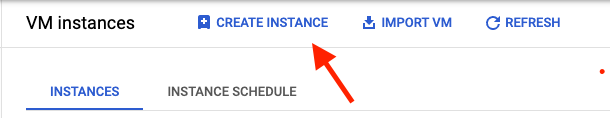
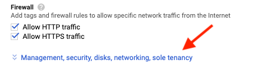

Recently, I decided to learn about Docker and how it can be used to run applications. Discovering this has since opened up my mind how we can make best use of our hardware's capacity.

In this tutorial, I will walkthrough the steps of getting Docker setup on a GCE instance on Google Cloud. By the end of this tutorial, you should have a VM setup with Docker installed to run your containerized applications.

Before you get started, this tutorial assumes you have a Google Cloud account and a project already setup.

# Step 0

## Log onto the GCP console and navigate to Compute Engine

# Step 1

## Create a VM instance

Once you've navigated to Compute Engine, click on the 'CREATE INSTANCE' button on the top.



We'll be leaving most configurations as the default but changing the OS and adding an extra disk.

Scroll down to Boot Disk and click on 'Change'. Here, select the following:
Operating System: Ubuntu
Version: Ubuntu 20.04 LTS
Boot disk type: Balanced persistent disk
Size (GB): 10

Next, scroll all the way to the bottom and select 'Management, security, disks, networking, sole tenancy'.



Click on the 'Disks' option and select '+ Add new disk'. You can keep most of the configurations as the default. The only thing I'd consider changing is the 'Name' and 'Size'.

Once you are satisfied with your instance, click on 'Create'. Give Google Cloud a few minutes to have your instance up and running.

# Step 2

## SSH into the instance

Now that we have the instance running, it's time we ssh into the VM and start setting up Docker.

There is a couple of ways to ssh into the instance. For this tutorial, I will use the browser option by clicking on the SSH button.


# Step 3

## Make sure you have no versions of Docker installed

Once you've ssh'd into the instance, we want to ensure that we have no versions of Docker installed.

The command shown below will remove any versions of Docker that you already have installed. Copy/paste this command into your instance's CLI.

```bash
$ sudo apt-get remove docker docker-engine docker.io containerd runc
```

# Step 4

## Installing Docker

Now it's time to install Docker. The first thing you'll have to do is add Docker's official GPG signing key.

```bash
$ curl -fsSL https://download.docker.com/linux/ubuntu/gpg | sudo gpg --dearmor -o /usr/share/keyrings/docker-archive-keyring.gpg
```
Next add the Docker official repository using the following command.

```bash
$ echo \
  "deb [arch=amd64 signed-by=/usr/share/keyrings/docker-archive-keyring.gpg] https://download.docker.com/linux/ubuntu \
  $(lsb_release -cs) stable" | sudo tee /etc/apt/sources.list.d/docker.list > /dev/null
```

Now we have to install Docker Engine. To do this, run the following 2 commands. The first command will refresh the apt cache, while the second will install Docker community edition.

```bash
$ sudo apt-get update
$ sudo apt-get install docker-ce docker-ce-cli containerd.io
```

# Step 5

## Check if Docker has been installed correctly

There is a few ways we can see if Docker has been installed correctly. 

The first thing we can do is run the following commands to check that the status is running and the version installed.

```bash
$ sudo systemctl status docker
$ docker --version
```

Next, log in as the root user and give permission to the current user to be able to run docker commands. Replace ${USER} with your username.

```bash
$ sudo -i
$ sudo usermod -aG docker ${USER}
```
Finally, log back in as the previous user and run your first container using the following commands.

```bash
$ su - ${USER}
$ docker run hello-world
```

At this point, you should see the "Hello from Docker!" message like below. If you don't see this message, check that you have given permissions to the current user; otherwise, re-visit the previous steps and see if you missed anything.


# That's It!

Well done! You should now have Docker setup on your VM instance and can start running containerized applications in the cloud. 

Keep in mind that if you decide to run a web-server such as Apache/Nginx in a container, ensure you check firewall rules. Otherwise, you will not see anything when attempting to connect via HTTP/HTTPS.

If you have any questions about this tutorial, feel free to reach out!

# Contact

You can find me on any of the following places!
- Website: [https://thanesh.io/]()
- Email: [thanesh.pannirselvam@gmail.com]()
- LinkedIn: [linkedin.com/in/thanesh-pannirselvam](https://linkedin.com/in/thanesh-pannirselvam)


