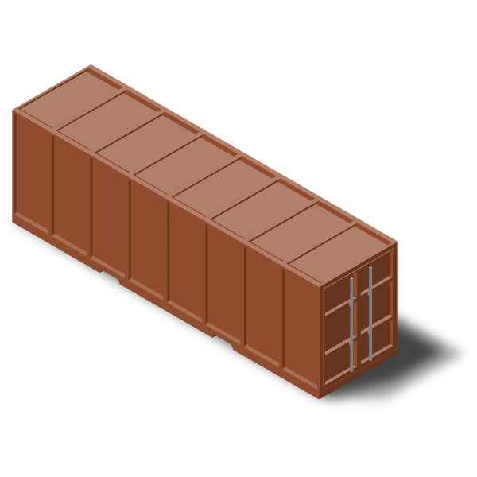

I've been learning about the cloud recently and keep coming across the term virtualization. At a high level, virtualization allows us to use a machine's total capacity by distributing its resources among many environments. Essentially, virtualization aims to solve one fundamental problem; efficiency.

In this blog, I'll give you an overview of Virtual Machines (VMs) and Containers by outlining the problems they aim to solve.

# A time before virtualization

In the past, when a business wanted to host an application, it had to procure a physical server. The company would have to speculate the demand for the application upfront before making the purchase. As such, they were likely to buy a high-end server which costs a lot of money.

Besides this, they would also incur monthly expenses like energy, workforce and licences. After spending all this money, they might realize that only a fraction of the capacity is being used. However, there was no way to allocate or make use of the resources that weren't needed. This is where Virtual Machines come in.

 

# Virtual Machines

The industry realized that having one server per application was rigid, clunky and expensive. In the late 1990s, VMware came out with a product that would solve this issue.

Virtualization, enabled by VMware, would allow organizations to squeeze more from their physical servers. Essentially, this technology virtualizes the physical server's hardware enabling the emulation of multiple computers on a single device.

For example, we can divide a server's resources into 3 VMs and have a separate application running on each VM. Each VM is isolated from the other and has the resources necessary to perform its given task. This enabled better hardware utilization but created a lot of overhead due to the required OS installation.

 

# Containers

Unlike a VM, a container does not require its own operating system. Containers virtualize the operating system, sharing the host kernel.

Each container packages your application code and its dependencies together. The application thinks it is running on a dedicated OS and hardware, but in reality, it is sharing the from the host OS.

However, compared to VMs, we are only managing one OS. No matter how many containers you have, there is only one host OS that needs to be addressed, i.e. reducing associated costs such as licences.

A container is tiny compared to a VM and can boot up in far lesser time. It also provides portability as it is not dependent on the underlying OS.

This means we can run code virtually anywhere with relative ease: multiple cloud providers, on-premise, local machines or even on VMs.

 

# Final Thoughts

Both VMs and Containers continue to serve a purpose in today's world. For example, when you request an instance on the cloud, you are accessing a virtual machine. The provider allocates some of their hardware for you to use, isolated from the rest of their users. You are then able to further leverage this instance by running containers on top of this.

At the end of the day, choosing what's best all depends on your circumstance. In some cases, you might even have to use a combination of both.

I hope this blog has given you an insight into VMs and Containers. Here are some resources that have helped me to better understand these concepts:

[https://www.redhat.com/en/topics/virtualization/what-is-virtualization]()  
[https://www.capitalone.com/tech/cloud/containers-vs-vms/]()  
[https://devopscube.com/what-is-docker/]()  

# Contact

You can find me at any of the following places!

- Website: [https://thanesh.io/](https://thanesh.io/)
- Email: [thanesh.pannirselvam@gmail.com](mailto:thanesh.pannirselvam@gmail.com)
- LinkedIn: [linkedin.com/in/thanesh-pannirselvam](https://linkedin.com/in/thanesh-pannirselvam)
