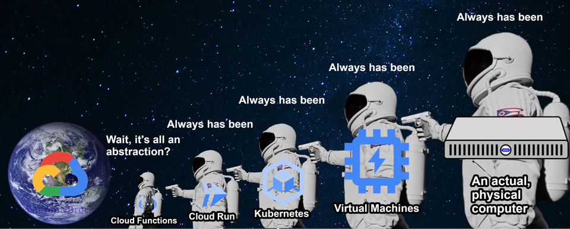

I've been learning about cloud recently and keep coming across terms such as containerization and Virtual machines (VMs). Although both these concepts are not limited to the cloud, they are become more prevalent as we move into this space.

In this blog post, I aim to explain what containers and VMs are. If you are looking to get into the infrastructure side of things, these concepts are a must know.

# Virtual Machines

Virtual Machines or VMs are said to be the foundation of cloud computing. Fundamentally, a VM is a emulation of a physical computer. VMs enable us to divide a server's resources into several emulated computers. For example, imagine we have a server that has 8 CPU cores and 4GM RAM.

Then we might be able to divide this server into 2 VM's:  
**VM 1**  
vCPU: 4 Cores  
vRAM: 2GB  
OS: Windows Server  

**VM 2**  
vCPU: 4 Cores  
vRAM: 2GB  
OS: Linux Ubuntu  

This means that we are virtualizing the underlying hardware allowing us to divide up our resources.

From a cloud perspective, when you spin up an instance, you are getting a VM with resources from a physical server shared amongst many other users.

# Containers

In contrast, containers aim to virtualize the operating system, only containing the application and its libraries and dependencies.

Containers are small, fast, and portable because they do not include a guest OS in every instance. 

Containers allow us to make even better use of our resources as we don't have to predefine the amount of resources we will need.

From a cloud perspective, this gives us the flexibility to ship our code between different cloud providers with relative ease.

# Final Thoughts

Both VMs and Containers have their place. In the cloud, containers are usually used on top of VMs, which if you think about it can allow you to make more effective use of an instance.

I don't believe you can say that one is better than the other but they both can be used for different cases. Containers have allowed us to make some processes more efficient.

https://www.reddit.com/r/googlecloud/comments/ot09xq/its_turtles_all_the_way_down/
