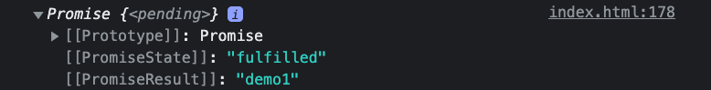

Recently, I have been working on the scrumblr-enhancement project on the roarcoders stream, where we have been attempting to display the boardName from the backend. However, we kept receiving a `promise` value that couldn't be accessed directly. After some research, the way forward was to add an `async/await`, enabling us to directly access and utilize the value.

After implementing this, the solution felt familiar. Many times when I have been stuck trying to fetch a value from the backend, `async/await` had solved the problem. And I don't believe this is uncommon.

In this blog, I will explain how `async/await` helped me solve this problem and why it works.

## What is a promise value?

Before we dive into `async/await`, it's essential to understand what promises are. The English definition of a promise is: "a declaration or assurance that one will do something or that a particular thing will happen". This definition applies to Javascript as well.

Like real life, when we receive a promise, it will either be kept or won't. In Javascript, there are three states of the Promise object which describe this:

  * Pending: Initial State, before the Promise succeeds or fails
  * Fulfilled: Completed Promise
  * Rejected: Failed Promise

In our scrumblr-enhancement code, shown below, we were receiving a 'fulfilled' promise. This meant that the asynchronous operation was completed successfully, and the `boardName` was being retrieved.

```javascript
    let result = getBoardById(boardId);
    document.getElementById("board-heading").innerHTML = result;
    console.log(result);
```
<i>Figure 1: Our first attempt to retrieve the boardName, without using async/await.</i>

<br>

<br/> <i align="center">Figure 2: The returned object, received as a promise value.</i>


## So, how do you access the promise value?

This is where `async/await` helped us.

We turned the above code into a function and added the `async/await` keywords. This successfully returned the value we needed to be displayed on the board.

```javascript
async function getBoardName(boardId) {
  let result = await getBoardById(boardId);
  document.getElementById("board-heading").innerHTML = result;
  console.log(result);
  return result;
}
```
<i>Figure 3: Creating a function and adding async/await to retrieve the boardName.</i>

<br>

<br/> <i>Figure 4: The returned value, this time received just as a string.</i>

## What is async/await?

There are plenty of resources explaining `async/await`, so I'll keep this brief.

Basically, Javascript executes synchronously, meaning that it has the potential to block further execution until it has finished what it's doing. Using the `async` keyword allows the program to continue running without stopping the main thread.

The `await` keyword has to be used inside an `async` function. Essentially, it makes Javascript wait until a `promise` object resolves to a value before moving on.

## Why did async/await solve our problem?

In our case, we were attempting to retrieve the boardName from the backend by using fetch-API. However, making a network request is time-consuming, and we cannot afford to wait for the function to finish executing before proceeding.

As such, Javascript returns a `promise` object indicating that it either received the value or didn't. In this case, the `promise` value was being fulfilled every time, but there is no guarantee that this would continue being the case.

As a result, making the function asynchronous allows Javascript to continue fetching the `boardName` from the backend whilst the frontend is being rendered. 

Using the `await` keyword means that the `boardName` would be resolved to a value that we can assign to a variable (`result` in the above code) and display on the board.
