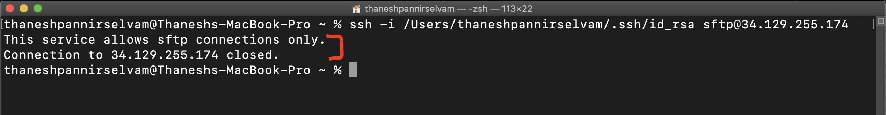
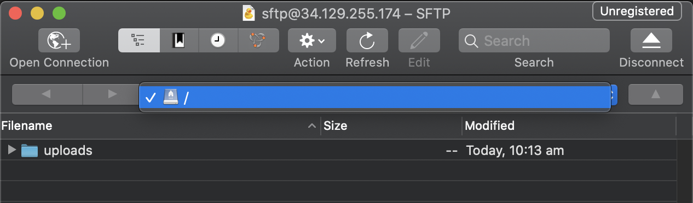

I've recently come across SFTP (SSH File Transfer Protocol) servers and wanted to set one up of my own. I created a simple Linux VM on GCP, added a new user, enabled password authentication, and I was ready to use this server. However, this wasn't an ideal solution.

For one, the server wasn't very secure as it allowed users to authenticate via password rather than SSH keys. Also, the newly created user would have access to all directories and privileges beyond those needed for SFTP duties.

Hence, to make this server more secured, I configured SSH key access and restricted the permissions of the SFTP user. This blog will show you how to go about doing the same.

# Step 0

## Provision a Linux VM

Before you proceed, this tutorial assumes you already have a Linux box set up with console/shell access.

If you don't already have one, you can easily create a VM on a cloud provider or install Linux on an old device you have at home.

In this tutorial, I have used a CentOS VM hosted on GCP; however, you can choose a different distro or cloud provider, and the process will be similar.

# Step 1

## Create a new user

Once you have your server ready, you will need to create a new user solely for SFTP purposes.

Access the CLI of your newly created VM; create a new user, and set its password using the following commands.

```bash
$ sudo adduser sftp
$ sudo passwd sftp
```

# Step 2

## Enable Password Authentication (Temporarily)

Now that you have a new user, you will have to enable password authentication temporarily so that we can make changes to the server from our local machine.

While in your server's CLI, open and edit the SSH config file. You can do this using the following command.

```bash
$ sudo vi /etc/ssh/sshd_config
```

Press the 'I' key to insert into the file, and use the arrow keys to locate `PasswordAuthentication`. Once you've found this, change this field to `yes`.

```bash
# To disable tunneled clear text passwords, change to no here!
PasswordAuthentication yes
#PermitEmptyPasswords no
#PasswordAuthentication no
```

After you've amended this, save and exit the file by pressing the ESC key followed by `:wq` and ENTER.

Now, restart the `ssh` service and check its status using the following commands.

```bash
$ systemctl restart sshd
$ systemctl status sshd
```

Also, check that you have SSH access from your local machine using your newly created user.

# Step 3

## Generate public/private key pair

At this point, you will need to create an SSH key pair from your **local machine** and copy the public key to your SFTP machine.

Firstly, create the key pair by running the command below, noting the returned path as you'll need it for the upcoming step.

```zsh
$ ssh-keygen -t rsa -b 4096 -C "sftp"
```

After creating the keys, copy the public key from your **local machine** onto your SFTP server using `ssh-copy-id`.

```zsh
$ ssh-copy-id -i [insert_path_of_ssh_key] sftp@<SERVER_IP>

#Example
$ ssh-copy-id -i /Users/thaneshpannirselvam/.ssh/id_rsa.pub sftp@192.158.1.38
```

# Step 4

## Test SSH and SFTP Connection

Now that you have copied over the public key, you will no longer need to have password authentication enabled. But, before disabling this, test that you can authenticate using your newly generated keys.

```zsh
$ ssh -i [insert_path_of_ssh_key] sftp@192.158.1.38

#Example
$ ssh -i /Users/thaneshpannirselvam/.ssh/id_rsa sftp@192.158.1.38
```

Additionally, try to authenticate using an SFTP client such as Cyberduck or FileZilla.

<p align="left" style="margin-bottom: 3%; margin-top: 3%;">

<br/> <i>Figure 1: SFTP Connection using Cyberduck Client.</i>
</p >

**Before proceeding to the next step, ensure you disable** `passwordAuthentication` **by amending the SSH config file (as described in Step 2)**.

# Step 4

## Configure SFTP space and restrict access

Right now, your user can SFTP into the server, but they also have shell access and access to other directories. If this meets your requirements, don't worry about following the rest of the tutorial.

However, creating a separate space for file transfers and restricting the SFTP user's access would be a more secure option.

To do this, create a new directory dedicated to file uploads and amend its permissions as shown below.

```bash
$ sudo mkdir -p /home/sftp/uploads
$ sudo chown root:root /home/sftp
$ sudo chmod 755 /home/sftp
$ sudo chown sftp:sftp /home/sftp/uploads
```

Next, limit the user to establish connection only via SFTP and restrict their access to a specific directory. To do this, edit `/etc/ssh/sshd_config`, adding this configuration to the end of the file.

```bash
Match User sftp
    ForceCommand internal-sftp
    PasswordAuthentication no
    ChrootDirectory /home/sftp
    PermitTunnel no
    AllowAgentForwarding no
    AllowTcpForwarding no
    X11Forwarding no
```

Restart the `ssh` service and check its status using the following commands.

```bash
$ systemctl restart sshd
$ systemctl status sshd
```

Finally, check that access via `ssh` is disabled, and SFTP connections are only permitted to the directory you specified.

<p align="left">
<br>

<br/> <i>Figure 2: Only SFTP connections permitted, shell access for `sftp` user has been disabled.</i>
</p >

<p align="left">
<br>

<br/> <i>Figure 3: Successful SFTP connection, but unable to traverse other directories, as expected.</i>
</p >

# That's It!

You've now set up your own SFTP server with SSH keys and restricted access. Using this server, you can trigger file uploads, schedule backups or manually upload content.

I hope this walkthrough helped you. If you have any questions, feel free to reach out!
