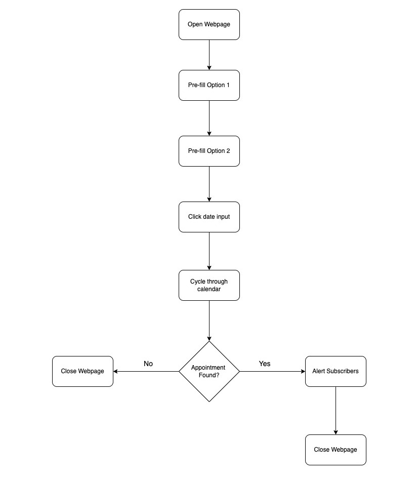

A few weeks ago, some members of my family needed to book appointments on a website concerning their identification. However, they couldn't get a spot as all appointments were booked out for the year of 2022.

Regardless, they kept accessing the website from time to time, in hopes that someone would cancel their appointment and they could swoop in. But the odds of finding an appointment randomly were low.

I thought about how this process of checking was manual, repetive and automatable. So I got to work and began figuring out a way to automate this for them.

In this post, I will discuss the approach I took, the tools/technologies I used and the possible downfalls in the hosts website.

Here is the link to the project github repository: [https://github.com/thaneshp/appointment-checker](https://github.com/thaneshp/appointment-checker)

## Initial Outlook

To begin, I thought about how a human would navigate the webpage and listed every step.

After attempting to book an appointment several times, I realised that there were fundamentally four steps of navigation:

1. Click and select a preferred location from the 1st drop-down field.

2. Click and select the reason for their appointment from the 2nd field.

3. Click on the date input field for the date selector to appear.

4. Cycle through the calendar, checking for any available dates.

<p align="left" style="margin-bottom: 3%; margin-top: 3%;">

<br/> <i>Figure 1: Appointment Website Layout.</i>
</p >

To translate this into code, I needed to include opening/closing of the browser, appointment checking and alerting of subscribers.

<p align="left" style="margin-bottom: 3%; margin-top: 3%;">

<br/> <i>Figure 1: Flowchart of Appointment Checking Steps</i>
</p >

## Implementation

At this stage, I plan in mind and was ready to get stuck into the code.

From my research, I found out that using Selenium with Python was the best way to go about this. With Selenium, you can go interact with HTML elements in Python through their `id`, `tag`, `xpath` and more.

For example, to select and pre-fill the first input field, I used the `id` field as shown below.

```Python
location_field = driver.find_element_by_id(FIRST_SELECT_ELEMENT_ID)
Select(location_field).select_by_value(FIRST_SELECT_ELEMENT_VALUE)
```

To aid me with using this library, I downloaded the [SelectorsHub - XPath Plugin](https://chrome.google.com/webstore/detail/selectorshub-xpath-plugin/ndgimibanhlabgdgjcpbbndiehljcpfh) on Google Chrome which indicates how to select specific elements using Selenium.


