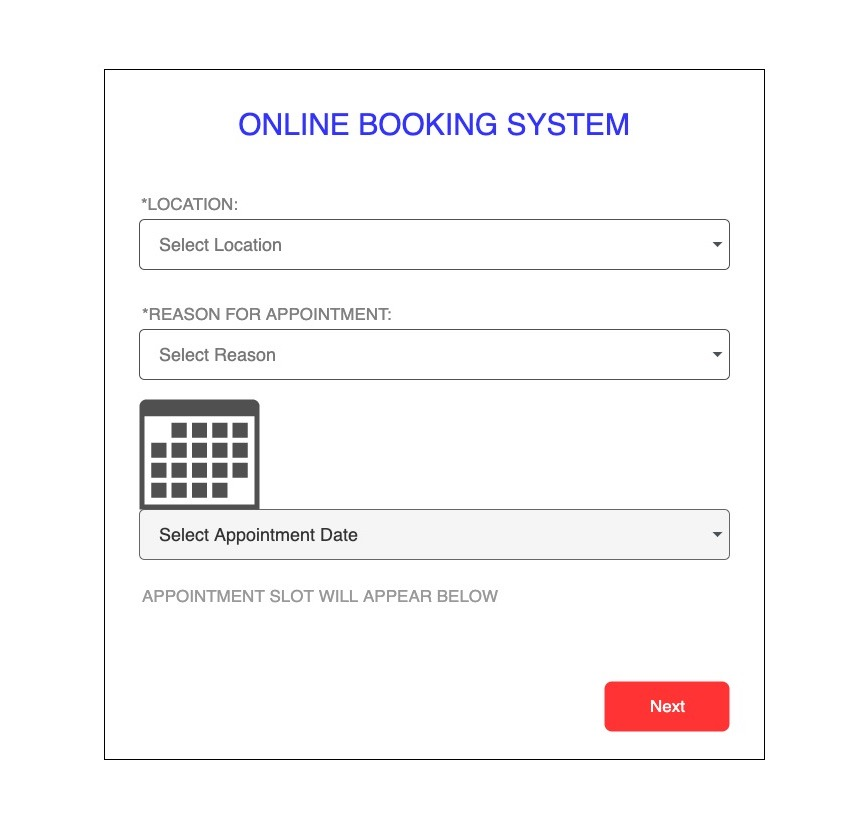

A few weeks ago, some members of my family needed to book appointments on a website concerning their identification. However, they couldn't get a spot as all appointments were booked out for the year of 2022.

Regardless, they kept accessing the website from time to time, in hopes that someone would cancel their appointment and they could swoop in. But the odds of finding an appointment randomly were low.

Upon watching their actions, I thought their actions were manual and repetive. So I got to work and began researching ways to automate this process.

In this post, I will discuss the approach I took, the tools/technologies I used and the downfalls in the hosts website.

Here is the link to the project github repository: [https://github.com/thaneshp/appointment-checker](https://github.com/thaneshp/appointment-checker)

## Initial Outlook

To begin, I started thinking about how I would approach this problem by reflecting on how a human would navigate the screen. 

After attempting to book an appointment several times, I realised that there were fundamentally four steps invovled.

1. 

  <i>Figure 1: Appointment Website Layout.</i>

