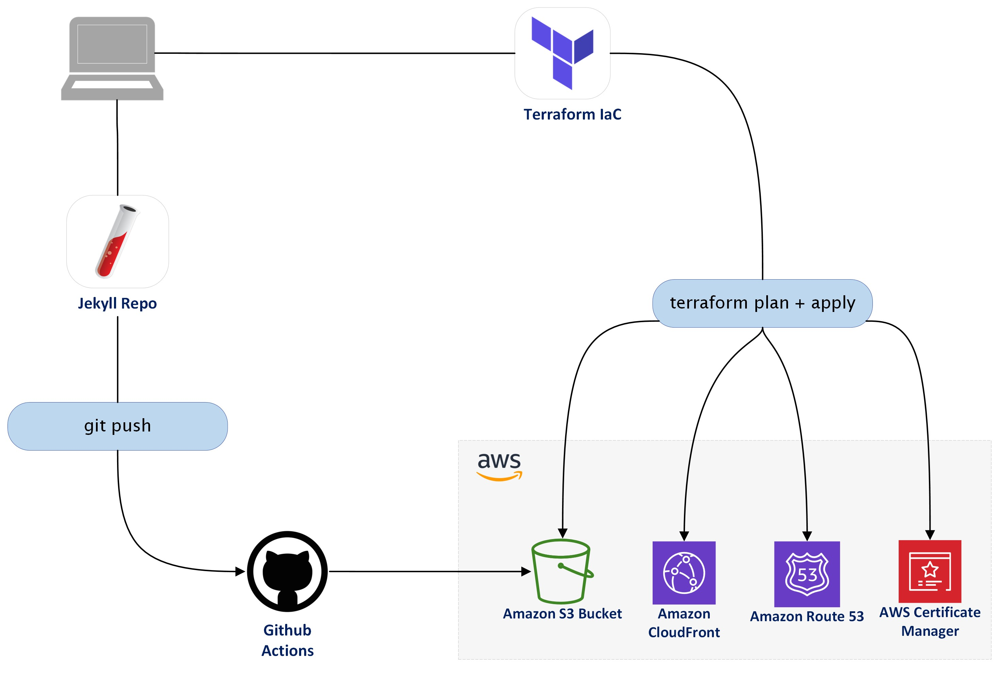

We all know how tedious clicking around the AWS Console can be.

You have to remember to create all the right resources, in the right order, and in the right region before anything works.

If you don't obey these laws, you'll be gifted with errors and frustration.

But eventually, with persistence, you'll figure it out, and all will be well... Until you have to do it again.

Anyways, this is what it was like for me.

So, in this blog, I will demonstrate how you can use Terraform and Github Actions to streamline this deployment process.

<p style="margin-top: 3%; text-align:center;">

<p style="margin: -1% 0 3% 7.8%; font-style: italic;" >Figure 1: High Level Implementation Diagram</p>
</p >

## Prerequisites

Before you get started, here are few things you'll need:

- AWS account with IAM user and programmatic access.
- Terraform installed on your local machine.
- Github repository containing your static site.
- Basic understanding of Terraform and Git.

## Create a Terraform Configuration

If you aren't aware, Terraform is an Infrastructure as Code (IaC) tool designed to help provision resources in the cloud. By writing HCL (Hashicorp Configuration Language), individuals can create cloud resources in an automated and consistent way.

For deploying a static site in AWS, you will need to describe the following resources in HCL:

- S3 Bucket for static files.
- CloudFront Distribution for delivering the website.
- Route 53 to route traffic from a domain name to the CloudFront Distribution.
- SSL Certificate in ACM to enable `HTTPS` traffic.

One thing to note is that in HCL, order **does not** matter. As long as you describe the right resources, Terraform will figure out the order to provision them for you.

If you'd like to see my complete Terraform configuration, you can check it out here - [https://github.com/thaneshp/terraform-aws-static-website](https://github.com/thaneshp/terraform-aws-static-website)

However, following my guideline below, you can create one of your own.

**Note:** I haven't included much code in this blog, as you can find everything you need from the Terraform AWS documentation - [https://registry.terraform.io/providers/hashicorp/aws/latest/docs](https://registry.terraform.io/providers/hashicorp/aws/latest/docs)

### Add AWS Providers

Typically, when you start writing a config, you have to declare a provider so that Terraform can interact with the respective cloud service.

For this config, you will have to denote two providers; one set in `ap-southeast-2` and the other in `us-east-1`.

This is because CloudFront will only accept SSL certificates created in `us-east-1`; therefore, we will need to reference this provider when requesting a certificate.

```hcl
# AWS provider for ap-southeast-1 region. Used as default.
provider "aws" {
  access_key = var.aws_access_key
  secret_key = var.aws_secret_key
  region     = "ap-southeast-1"
}

# AWS provider for us-east-1 region.
provider "aws" {
  alias      = "us-east-1"
  access_key = var.aws_access_key
  secret_key = var.aws_secret_key
  region     = "us-east-1"
}
```

### Creating the S3 Bucket

Once the providers are organised, you can start declaring the S3 Bucket creation.

Since you'll be hosting a website, you will need the following resources:

- `aws_s3_bucket`
- `aws_s3_bucket_acl`
- `aws_s3_bucket_website_configuration`
- `aws_s3_bucket_versioning`
- `aws_s3_bucket_policy`

Under the `aws_s3_bucket_policy` resource, you'll also have to add the following policy; replacing `wiki.thanesh.io` with your domain name.

This policy enables read access to the Bucket's objects, necessary when hosting a website.

```hcl
# Bucket Policy to allow read access to objects.
resource "aws_s3_bucket_policy" "website_bucket_allow_read_access_to_objects" {
  bucket = aws_s3_bucket.website_bucket.id

  policy = jsonencode({
    "Version" : "2012-10-17",
    "Statement" : [
      {
        "Sid" : "PublicReadGetObject",
        "Effect" : "Allow",
        "Principal" : "*",
        "Action" : "s3:GetObject",
        "Resource" : "arn:aws:s3:::wiki.thanesh.io/*"
      }
    ]
  })
}
```

### Request an SSL Certificate via ACM

To enable `HTTPS` traffic, you will need an SSL certificate. This certificate is used when creating a CloudFront distribution; hence, it must be requested before the distribution.

As I mentioned before, this certificate has to be based in `us-east-1` to be used by CloudFront. Therefore, ensure you reference this provider in your config.

Depending on your needs, you may use a wildcard asterisk for your domain name, e.g. `*.thanesh.io`. This means that the certificate can cover more variations of your domain, e.g. `blog.thanesh.io` or `wiki.thanesh.io`.

Under `subject_alternative_names`, include your base domain to cover all variations that you'll possibly be using.

```hcl
# Request SSL Certificate in ACM.
resource "aws_acm_certificate" "cert" {
  provider                  = aws.us-east-1
  domain_name               = "*.thanesh.io"
  subject_alternative_names = [thanesh.io]
  validation_method         = "DNS"

  lifecycle {
    create_before_destroy = true
  }
}
```

### Create a CloudFront Distribution

Now that you have an SSL certificate, you can create the CloudFront Distribution.

If you aren't aware, the CloudFront service distributes your website across AWS edge locations to improve performance for the end-user.

In this part of the config, you'll have to reference your website's bucket domain name and the previously created SSL certificate.

You'll also have to provide an `origin_id` which you can name what you like. If you're wondering, an origin in CloudFront specifies where the content is stored and where it gets content to serve to viewers. So try to make this name meaningful.

Lastly, if you'd like to use a caching policy, you can specify one under `default_cache_behavior`. You can find all the managed policies offered by AWS here - [https://docs.aws.amazon.com/AmazonCloudFront/latest/DeveloperGuide/using-managed-cache-policies.html](https://docs.aws.amazon.com/AmazonCloudFront/latest/DeveloperGuide/using-managed-cache-policies.html)

**Note:** The `cache_policy_id` option requires the 'ID' and not the 'Name'. Example: `"658327ea-f89d-4fab-a63d-7e88639e58f6"`

```hcl
# Cloudfront Distribution for S3 bucket.
resource "aws_cloudfront_distribution" "website_bucket_s3_distribution" {
  origin {
    domain_name = aws_s3_bucket.website_bucket.bucket_regional_domain_name
    origin_id   = format("%s%s","S3-Website-",aws_s3_bucket.website_bucket.bucket_regional_domain_name)
  }

  enabled             = true
  is_ipv6_enabled     = true
  default_root_object = "index.html"

  aliases = ["wiki.thanesh.io"]

  default_cache_behavior {
    allowed_methods  = ["DELETE", "GET", "HEAD", "OPTIONS", "PATCH", "POST", "PUT"]
    cached_methods   = ["GET", "HEAD"]
    cache_policy_id  = var.managed_caching_policy
    target_origin_id = format("%s%s","S3-Website-",aws_s3_bucket.website_bucket.bucket_regional_domain_name)

    viewer_protocol_policy = "redirect-to-https"
    min_ttl                = 0
    default_ttl            = 3600
    max_ttl                = 86400
  }

  restrictions {
    geo_restriction {
      restriction_type = "none"
    }
  }

  viewer_certificate {
    acm_certificate_arn = aws_acm_certificate.cert.arn
    ssl_support_method  = "sni-only"
  }
}
```

### Add Record Set in Route 53

At this stage, you should have everything needed to host and deliver a static site—however, not much way to conveniently share it.

If you don't have a hosted zone in Route 53, you'll need to add this to your config, alongside adding an `A` record to route your traffic to the CloudFront distribution.

However, in my case, I'll just be doing the latter as I already have a hosted zone that I'd like to extend.

To do the same, you would use the `aws_route53_record` resource and specify the following:

- The `zone_id` of the hosted zone
- The domain name of the website (e.g. wiki.thanesh.io)
- The record type (e.g. A)
- Details about the CloudFront distribution

**Note:** The `zone_id` parameter in the `aws_route53_record` resource only accepts the `zone_id` of the hosted zone and not its name. You can reference the `zone_id` similar to how I have below.

```hcl
# Retrieve existing hosted zone.
data "aws_route53_zone" "my_domain" {
  name = "thanesh.io"
}

# Add A record in Route53 for website.
resource "aws_route53_record" "website_record" {
  zone_id = data.aws_route53_zone.my_domain.zone_id
  name    = "wiki.thanesh.io"
  type    = "A"

  alias {
    name                   = aws_cloudfront_distribution.website_bucket_s3_distribution.domain_name
    zone_id                = aws_cloudfront_distribution.website_bucket_s3_distribution.hosted_zone_id
    evaluate_target_health = false
  }
}
```

### Provision the Infrastructure

Now that you have everything needed to host your static site in AWS, it's time to provision the infrastructure.

To do this, run the following commands.

```bash
# Verifies whether a configuration is syntactically valid and internally consistent
terraform validate

# Used for creating an executing plan.
terraform plan

# Executes the actions proposed in a Terraform plan.
terraform apply
```

## Set Up Github Actions

All your infrastructure is now ready, and it's time to deploy your site.

You may be tempted to drag and drop all your static files right into the S3 Bucket, but there is a better way.

In this part of the blog, I will show you how to set up Github Actions to automatically deploy your website into the S3 Bucket.

If you prefer a video tutorial, you can check out the one I made here - [https://www.youtube.com/watch?v=ifqG6tGhHHE](https://www.youtube.com/watch?v=ifqG6tGhHHE)

### Add your AWS Secrets to the Github Repository

1. Navigate to website's Github Repo using the web UI.
2. Click on Settings -> Secrets -> Actions.
    <p style="margin-top: 2%; text-align:left;">
    
    </p >
3. Click on 'New repository secret' in the top right-hand corner.
4. Create new 3 secrets for: `AWS_S3_BUCKET`, `AWS_ACCESS_KEY_ID` and `AWS_SECRET_ACCESS_KEY`, adding their respective values.

### Create a new Directory in your Website's Repo

On your local machine, navigate to your website's root directory and create the following directories: `.github/workflows`

You can use the following command if you're on Mac/Linux: `mkdir .github/workflows`

Github Actions looks in this folder for a `.yaml` file containing workflow instructions.

### Create a YAML file

In the `.github/workflows` directory, create a file called `main.yaml`.

This is where you will add the config for Github Actions to execute.

### Add actions to the YAML file

Once you have created the YAML file, you need to add some actions to tell Github what to do with your repo.

Below is the config I used. This config builds and deploys my Jekyll site on `push` to the `main` branch. I got this config from [here](https://github.com/marketplace/actions/build-jekyll) and made a few adjustments.

If you're not using a Jekyll site, you may want to create/find a different config. Here is one that I used for another site (pure HTML, CSS and JS) - [https://github.com/jakejarvis/s3-sync-action](https://github.com/jakejarvis/s3-sync-action).

```yaml
on:
  push:
    branches:
      - main

jobs:
  jekyll:
    name: Build and deploy Jekyll site
    runs-on: ubuntu-latest

    steps:
      - name: Checkout
        uses: actions/checkout@v2

      - name: Build
        uses: jerryjvl/jekyll-build-action@v1

      - name: Configure AWS credentials
        uses: aws-actions/configure-aws-credentials@v1
        with:
          aws-access-key-id: ${{ secrets.AWS_ACCESS_KEY_ID }}
          aws-secret-access-key: ${{ secrets.AWS_SECRET_ACCESS_KEY }}
          aws-region: ap-southeast-2

      - name: Sync output to S3
        run: |
          aws s3 sync ./_site/ s3://${{ secrets.AWS_S3_BUCKET }} --delete
```

### Push your changes to Github

Once your config is ready, push your changes to Github, and your website will be automatically uploaded to S3.

And that's it; your static site is live and will auto-update every time you push to your repository.