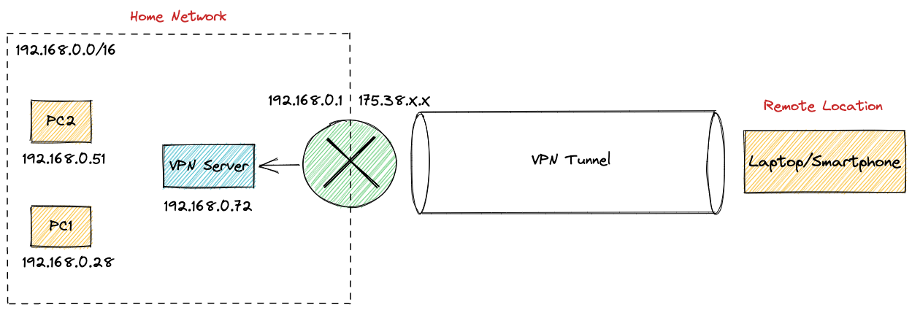
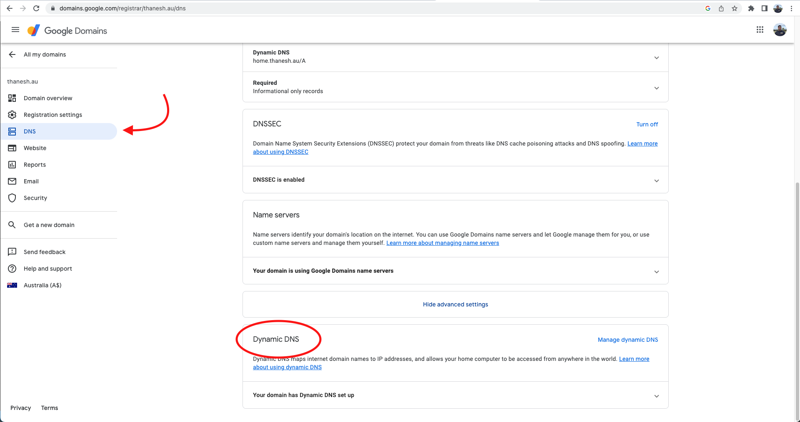
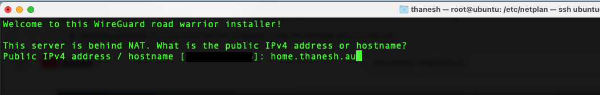
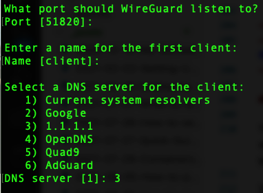
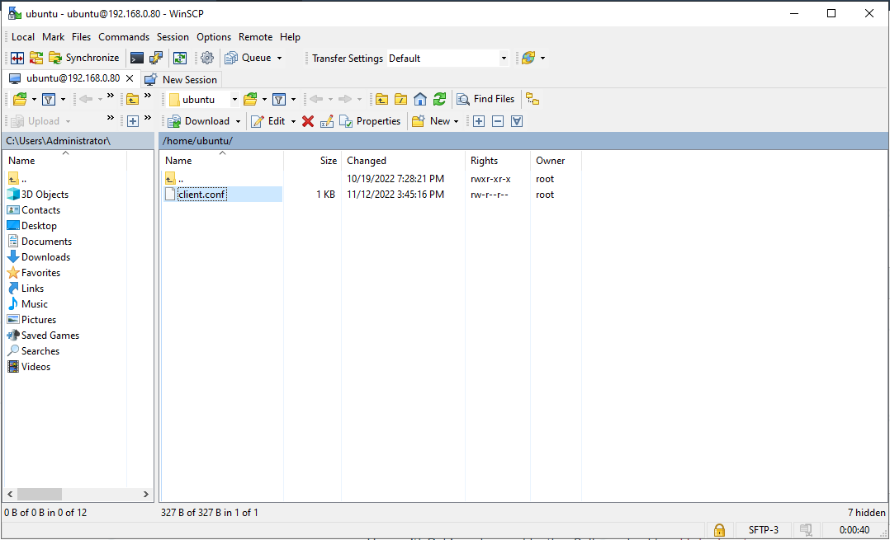
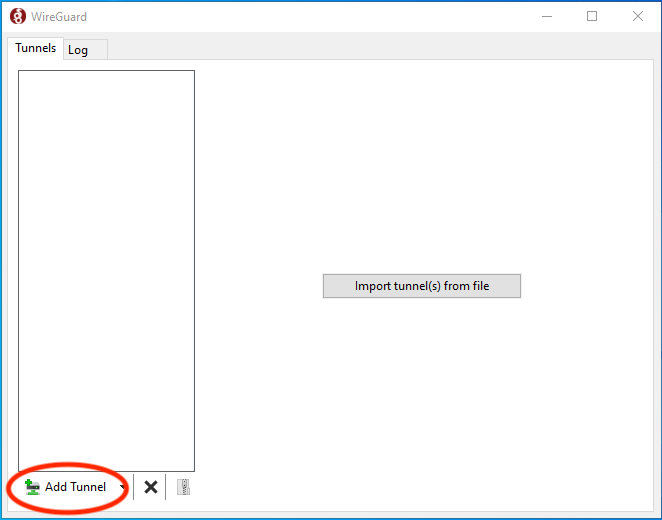

So I'm looking to put together a home lab for testing out and learning new things; however, the problem with a home lab is that... well it's at **home**.

This means that it is on a private network and, therefore, not accessible from the internet, which is fine if I only expect to test things when I'm at home. However, this isn't always the case.

So this is where a VPN server comes in.

Similar to working remotely, we can set up our own VPN server to connect from anywhere, so long as we have an internet connection.

In this blog, I will walk you through the process of setting up your own VPN server at home.

<p style="margin-top: 3%; text-align:center;">

<p style="margin: -1% 0 3% 7.8%; font-style: italic;" >Figure 1: High Level Network Diagram</p>
</p >

## Prerequisites

Before you get started, here are a few things you'll need.

### *1. Access to a Linux Machine (physical/virtual)*

This can be a Raspberry Pi, an old laptop, a Virtual Machine (VM) or anything else that can run Linux. For this tutorial, I've used a Raspberry Pi, as that's what I have set up in my environment.

### *2. Public Domain Name*

(or static IP)

Unless you have a static IP address assigned to your router, you'll have to use this method to connect to your VPN server.

### *3. Access to your Router's Administration Page*

As part of setting up this server, you'll need to add a rule for port forwarding on your router. To do this, you will definitely need access to your router's configuration page.

## Set up a Linux Machine

The first step is to set up your Linux Machine. As mentioned above, this can be any machine you desire, as long as it runs Linux and connects to your home network.

For my environment, I chose to use Ubuntu Server (22.10) as this is a popular lightweight distro. You can find the download for Ubuntu Server [here](https://ubuntu.com/download/server).

### Optional: Connecting to Wifi

If you are using a Raspberry Pi or a physical machine, you may need to set up Wifi manually. Below is the process I used to connect to Wi-Fi on my Raspberry Pi.

1. Determine the wireless adapter used by your machine. It should be something like `wlan0`.

    ```bash
    $ ls /sys/class/net
    ```

2. Open and edit the Netplan config file.

    ```bash
    $ vi /etc/netplan/50-cloud-init.yaml
  ```

3. Add this config to the bottom of the existing config. Ensure it is indented correctly.

    ```yaml
        wifis:
            wlan0:
                optional: true
                access-points:
                    "SSID-NAME-HERE":
                        password: "PASSWORD-HERE"
                dhcp4: true
    ```

4. Run this command to apply the changes.

    ```bash 
    $ sudo netplan apply
    ```

5. Check your wireless adapter has connected to the network and been assigned an IP address.

    ```bash
    $ ip a 
    ```

### *Note for Virtual Machine Users*

If you are using a VM to host your Linux machine, you'll have to change the network setting to a **Bridged Network**. By doing this, your device will be considered as a full network participant, meaning it can participate as though it is a physical machine in the network.

More information about this can be found [here](https://docs.vmware.com/en/VMware-Workstation-Pro/16.0/com.vmware.ws.using.doc/GUID-BAFA66C3-81F0-4FCA-84C4-D9F7D258A60A.html).

## Setting up Dynamic DNS

To connect to your VPN server from the internet, you'll have to use a public domain name. However, you won't be able to map your domain name to your network's public IP address as you would with traditional DNS, as your IP is likely to change.

To workaround this issue, we can use Dynamic DNS.

In essence, Dynamic DNS allows us to keep our DNS record in sync with any changes to our network's public-facing IP address.

There are two steps to set this up: 
Add an A record for Dynamic DNS
Install/configure `ddclient`.

If you have a static IP address and prefer to use that instead, feel free to skip this step.

### Adding an `A` record for Dynamic DNS

Depending on your DNS provider, you may have to configure Dynamic DNS and then add an `A` record for the name you want to update dynamically.

If you are using *Google Domains*, you will find this setting under the DNS section and by scrolling down until you find Dynamic DNS.

<p style="margin-top: 2%; text-align:left;">

</p >

Once you find this location on your DNS provider, add an `A` record with your desired name.

<p style="margin-top: 2%; text-align:left;">

</p >

### Installing/Configuring `ddclient`

Once you've added the additional record to the DNS provider, you'll have to install and configure `ddclient` on your Linux machine.

`ddclient` is a tool that will check for any changes to your public IP address and update the Dynamic DNS entry.

If you're using Ubuntu, run the following command to install `ddclient`.

```shell
$ sudo apt install ddclient
```

Once `ddclient` has been installed, you'll need to update its configuration.

```shell
$ sudo vi /etc/ddclient.conf
```

Next, you will need to add in the following configuration, adding in your requirements. If you are using *Google Domains*, you can find the required credentials by clicking on ***View Credentials*** beside your domain name.

```shell
protocol=googledomains
login=<generated_username>
password=<generated_password>
your_resource.your_domain.tld
```

Once you've saved the config, restart `ddclient` to ensure your configuration is applied.

```shell
$ sudo systemctl restart ddclient
```

You can verify that it has worked by checking if the IP shown on your dynamic DNS entry is the same as your current public IP address.

## Enable Port Forwarding

Now that we have Dynamic DNS configured, we have to set up port forwarding so that when we request the hostname, our router knows where to send that traffic internally.

Before we can do that, we have to set a static IP address for our server so that it doesn't change.

### Configure a Static IP for your server

If you are using Ubuntu, you'll need to edit the following file.

```shell
$ sudo vi /etc/netplan/50-cloud-init.yaml
```

In this file, we are adding the static IP, setting DHCP to `false`, adding the default gateway and DNS servers.

```yaml
network:
    wifis:
      wlan0:
        optional: true
        access-points:
          "SSID-NAME-HERE":
              password: "PASSWORD-HERE"
        dhcp4: false
        addresses: [192.168.0.80/24]
        routes:
        - to: default
          via: 192.168.0.1
        nameservers:
          addresses: [8.8.8.8,8.8.4.4]
    version: 2
```

Once you've added those configurations, run the following command to apply the changes.

```shell
$ sudo netplan apply
```

### Creating the Port Forwarding Rule

Port forwarding is your router's method of directing external connections to internal devices. 

By default, when we attempt to connect to our VPN server from a different network, our router doesn't know how to direct that connection internally. So, you'll need to add a rule to tell it how to do this.

Adding this rule varies depending on the router you are using, so I'll just explain the rule you'll need to add.

As shown below, you'll need to add a rule to forward external port `51820` connections to internal `51820` connections for your server's IP.

<p style="margin-top: 2%; text-align:left;">

</p >

## Installing Wireguard VPN

To install Wireguard, we can use [this script](https://github.com/Nyr/wireguard-install) offered by a generous Github user.

In a nutshell, you'll just need to run the following command on your server.

```bash
$ wget https://git.io/wireguard -O wireguard-install.sh && bash wireguard-install.sh
```

During the installation, it will prompt you to enter your domain name. 

<p style="margin-top: 2%; text-align:left;">

</p >

Next, it will prompt you to enter some further options for port, client name and DNS. I've left the first two options as the default and selected the 3rd option for DNS.

<p style="margin-top: 2%; text-align:left;">

</p >

After this, the installation process will continue as normal.

## Connecting to your VPN

At this point, your VPN server should be fully set up. Now it's time to install the Wireguard Client and test the connection.

### Install Wireguard Client on your PC

To install the client, visit this link and download the option for your OS - [https://www.wireguard.com/install/](https://www.wireguard.com/install/).

### Copy the Config file over to your PC

From the VPN server, you'll have to copy the Wireguard config file to your local machine.

The config file is stored in `/root`, but we'll have to move it into `/home/<user>` before we can copy it out.

```bash
# Example
$ cp /root/client.conf /home/ubuntu
```

Next, SFTP to your VPN server and copy that file to your PC. Since I'm using Windows as my VPN client, I'll use WinSCP to do this.

<p style="margin-top: 2%; text-align:left;">

</p >

### Add Config to Wireguard Client

Finally, open up the Wireguard Client and click the `Add Tunnel` button to add the config file you copied out.

<p style="margin-top: 2%; text-align:left;">

</p >

### Test Connection

At this point, everything should be set up and ready to go; but it's always a good idea to test things out.

To test if everything works, you can connect to your personal hotspot and then activate Wireguard to see if you can `ping` devices on your local network.

If everything was set up correctly, you should have no problem doing so!

